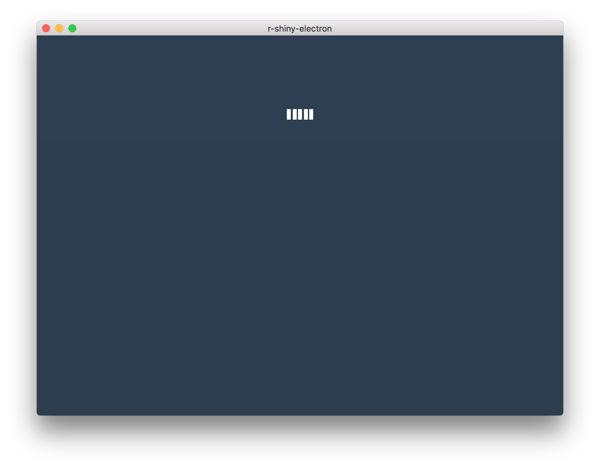
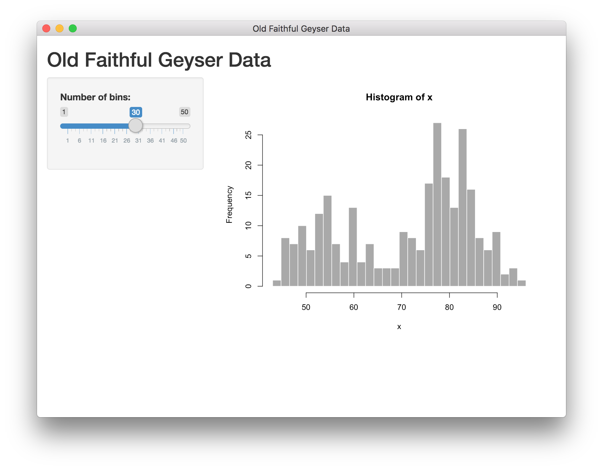

# R shiny and electron

This is a work in progress template for R shiny and electron integration

_NOT FOR PRODUCTION_

## Quickstart

* Clone
* `npm install`
* Download mac binaries `sh get-r-mac.sh`
* Download shiny `Rscript add-cran-binary-pkgs.R`
* `npm start`

## App

The app currently starts with a loading screen while trying to start the shiny app as a seperate process. If successful, it will switch to the shiny app once it is loaded. If not successful after 3 trys and error is shown.

Loading:

App:

## References

* The initial javascript template is based on the template from `electron-forge`
* This project is inspired by the work of [@ksasso](https://github.com/ksasso/useR_electron_meet_shiny)